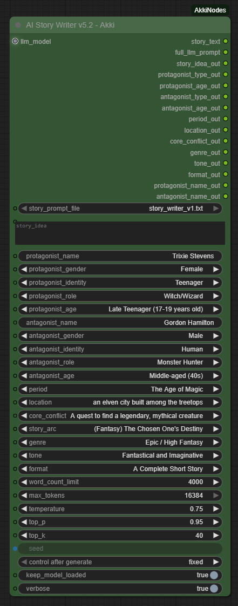
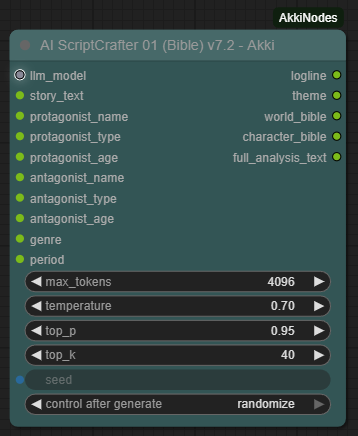
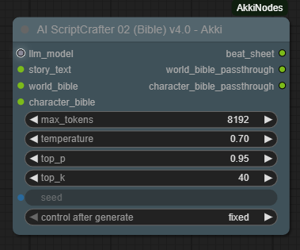
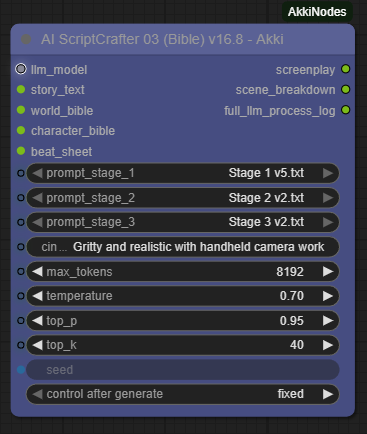
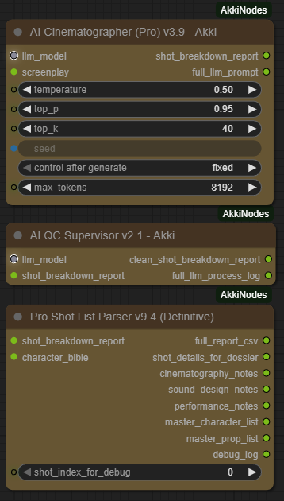
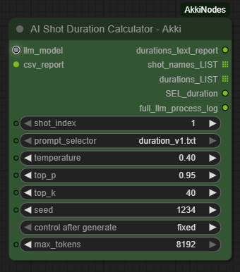
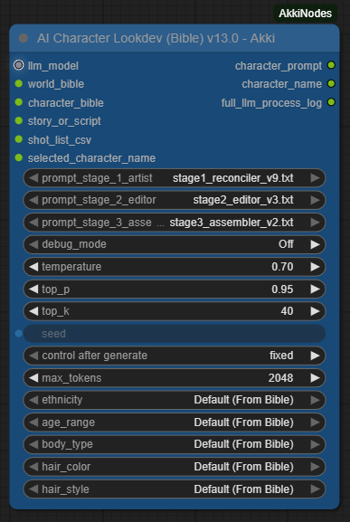
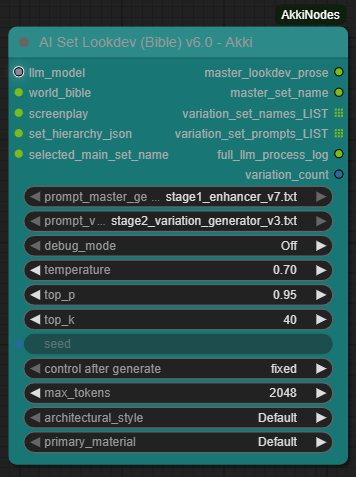
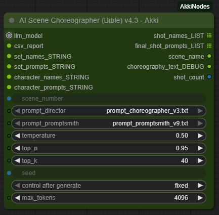

  

# 🎭 AI Akki's GenAI Suite: Your Personal AI Film Studio

  
  
  
  

The world of Generative AI is often a chaotic collection of powerful but disconnected tools. My work is dedicated to solving this problem. As a GenAI Creative Engineer, I specialize in architecting robust, autonomous **AI Agents** and integrating them into seamless, production-ready workflows. This project, the AkkiNodes Suite for ComfyUI, is a practical demonstration of this philosophy, designed to provide a fully automated "Script to Screen" pipeline that runs entirely on your local machine.

---

## ✨ My Engineering Philosophy

My approach to building with Generative AI is guided by a core set of engineering principles, designed to create robust, reliable, and truly automated systems.

**1. The "Specialist Model": A Crew of AI Agents**
I design workflows that operate like a professional production team. Instead of relying on a single, monolithic AI, this suite is powered by a crew of highly specialized **AI Agents**. Each agent (the *ScriptCrafter*, the *Cinematographer*, the *Lookdev Artist*) is an expert in its domain, leading to higher quality, more consistent, and more controllable creative outputs.

**2. Code is Law: Deterministic Systems over Non-Deterministic AI**
For tasks that require absolute precision and reliability—like data parsing, formatting, or enforcing factual continuity—AI is the wrong tool. My workflows use AI for what it does best (creativity) and rely on robust, deterministic Python code for what AI does poorly (correctness). This "Python Enforcer" pattern is the key to a stable pipeline.

**3. Fix Data at the Source: Proactive Quality Control**
A stable workflow cannot be built on a foundation of "garbage-in, garbage-out." My philosophy is to fix data errors and creative deficiencies in the node that produces them (the "producer"), rather than creating "patch" nodes downstream. This keeps the pipeline lean, efficient, and easy to debug.

**4. 100% Local, 100% Private (The Foundation)**
And finally, your creative process should be yours alone. This entire suite of tools and agents is built to run entirely on your local machine, guaranteeing total privacy, zero API fees, and complete creative control over your work.

**5. The Assembly Line: End-to-End Automation**
The ultimate goal of a robust workflow is to minimize manual friction. This suite is architected as an automated production line where you provide the high-level creative inputs—the 'building blocks' of your story—at the beginning. From there, the chain of AI Agents and deterministic tools handles the entire production process, automatically generating the narrative documents, production data, and final visual prompts without requiring manual file editing or data correction between stages.

---

## ⚙️ Installation Guide

1.  **Clone or Download:**
    *   Clone this repository into your `ComfyUI/custom_nodes/` directory.
    *   Alternatively, download the ZIP, extract it, and place the `AkkiNodes-LLM-Suite-for-ComfyUI` folder inside `ComfyUI/custom_nodes/`.

2.  **Install Dependencies (Windows):**
    *   Navigate into the new `AkkiNodes-LLM-Suite-for-ComfyUI` folder.
    *   **Right-click `install.bat` and select "Run as administrator"**. This only needs to be done once.

3.  **Download a GGUF Model:**
    *   This suite requires a GGUF-format Large Language Model. You can find thousands of compatible models on [Hugging Face's GGUF Model Hub](https://huggingface.co/models?search=gguf).
    *   Place your downloaded `.gguf` file into your `ComfyUI/models/llms/` directory.

4.  **Restart ComfyUI:**
    *   Completely close and restart your ComfyUI instance.

---

## 🖥️ System & Environment

This suite is designed for local execution and is GPU-intensive, particularly during LLM and image generation phases. The primary development and testing environment is as follows:

*   **OS:** Windows 11 Pro
*   **CPU:** 13th Gen Intel Core i7-13700K
*   **GPU:** NVIDIA GeForce RTX 3060
*   **VRAM:** 12 GB
*   **System RAM:** 64 GB
*   **ComfyUI Version:** v0.3.50
*   **Python Version:** v3.12.0

While the suite may work on other configurations, performance will vary. A GPU with at least **12GB of VRAM** is strongly recommended for a smooth experience when loading larger GGUF models.

---

## ▶️ Video Tutorial: Full Workflow Demo

**[Click here to watch the full "Script to Screen" workflow demonstration on YouTube.](https://youtu.be/woMTMyN94CI)**

---

## 🚀 Example Workflow File

You can download the complete ComfyUI workflow file demonstrated in the video tutorial directly from this repository. Drag and drop this file onto your ComfyUI canvas to load the entire workflow.

**[Download the Workflow JSON here](./WorkflowExample/Akki%20LLM%20Agents%20Suits%20WorkflowExample.json)**

---

## 📖 Node Reference (Core Production Suite v77.0.0)

### Phase 1: Narrative Development
*Goal: To transform a simple idea into a complete, well-structured, and machine-readable screenplay.*

| Node UI | Name, Function & Version | Validated Architecture |
| :---: | --- | --- |
|  | **`AI Story Writer (v5.2)`**   The starting point of the pipeline. Takes a concept and creative parameters to generate a complete prose story. | "Orthogonal Input & Ground Truth Mandate" |
|  | **`AI ScriptCrafter P1 (Bible) (v7.2)`**   Creates the canonical **Character & World Bibles**. | "Analyze & Refine" |
|  | **`AI ScriptCrafter P2 (Beat Sheet) (v4.0)`**   Creates a 15-point structural blueprint for the story. | N/A |
|  | **`AI ScriptCrafter P3 (Screenplay) (v16.8)`**   Writes the screenplay and uses a powerful parser to guarantee perfect formatting. | "Creative Draft + Hybrid Heuristic Parser" |

### Phase 2: Pre-Production & Data Consolidation
*Goal: To translate the screenplay into a single, canonical spreadsheet (CSV) that governs the visual production.*

| Node UI | Name, Function & Version | Validated Architecture |
| :---: | --- | --- |
|  | **The Pre-Production Pipeline**   This chain of nodes works together to create the final production CSV.   1. `AI Cinematographer (Pro) (v3.9)`   2. `AI QC Supervisor (v2.1)`   3. `Pro Shot List Parser (v9.4)` | "Hybrid AI + Deterministic Resolver" & "Context-Aware Two-Pass Transform" |
|  | **`AI Shot Duration Calculator`**   An AI agent that analyzes the CSV to provide accurate shot duration estimates for video editing. | N/A |

### Phase 3: Visual Development (Lookdev)
*Goal: To establish the final, approved "art direction" for every character and set.*

| Node UI | Name, Function & Version | Validated Architecture |
| :---: | --- | --- |
| *(Utility Node)* | **`Asset Selector (v3.6)`**   The Production Manager. Reads the final CSV and provides master lists of all assets for look development. | N/A |
|  | **`AI Character Lookdev (v13.0)`**   The Character Art Department. Generates rich, story-specific prompts for character creation. | "Hybrid Multi-Stage AI + Python Enforcer" |
|  | **`AI Set Lookdev (v6.0)`**   The Set Design Department. Generates detailed prompts for set design and time-of-day variations. | "Time-Only Variation Engine" |

### Phase 4: Shot Production (Final Prompting)
*Goal: To combine the art direction from Phase 3 with the action of a single shot to create a final, ready-to-render image prompt.*

| Node UI | Name, Function & Version | Validated Architecture |
| :---: | --- | --- |
| *(Utility Node)* | **`Shot Selector (v3.6)` & `Shot Asset Loader (v3.7)`**   Utilities for isolating a single shot and fetching all of its required data and lookdev assets. | N/A |
|  | **`AI Scene Choreographer (Bible) (v4.3)`**   The creative engine for this phase. Generates bible-aware, lookdev-consistent prompts for all shots in a scene. | "Director + Promptsmith Pipeline" |

### Utilities

| Node UI | Name, Function & Version | Purpose |
| :---: | --- | --- |
| *(Utility Node)* | **`LLM Loader` & `LLM Loader (LM Studio)`** | The core nodes for loading your local GGUF language models or connecting to an LM Studio server. |
| *(Utility Node)* | **`File I/O Nodes`** | A comprehensive suite of utilities for project management and saving/loading project data. |